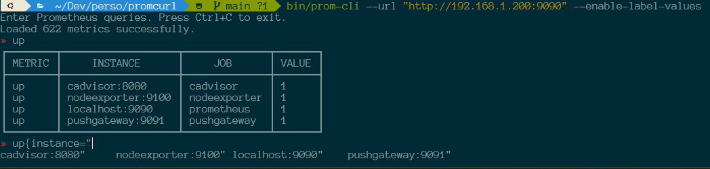

# 🔍 Prometheus CLI

[](https://github.com/SckyzO/prometheus-cli/actions/workflows/release.yml)
[](https://golang.org/doc/devel/release.html#go1.21)
[](https://opensource.org/licenses/MIT)

A powerful command-line tool for querying Prometheus metrics with advanced autocompletion capabilities.

## 📋 Table of Contents

- [🔍 Prometheus CLI](#-prometheus-cli)
  - [📋 Table of Contents](#-table-of-contents)
  - [📝 Overview](#-overview)
  - [✨ Features](#-features)
    - [🔍 Core Functionality](#-core-functionality)
    - [🔄 Advanced Autocompletion](#-advanced-autocompletion)
    - [🔒 Security \& Authentication](#-security--authentication)
    - [⚙️ Configuration](#️-configuration)
  - [📥 Installation](#-installation)
    - [From Source](#from-source)
    - [Using Go](#using-go)
  - [🚀 Usage](#-usage)
    - [Command Line Options](#command-line-options)
    - [Examples](#examples)
  - [⚙️ Configuration File](#️-configuration-file)
  - [🛠️ Development](#️-development)
    - [Prerequisites](#prerequisites)
    - [Building](#building)
    - [Testing](#testing)
    - [Cross-compilation](#cross-compilation)
  - [📁 Project Structure](#-project-structure)
  - [📄 License](#-license)
  - [📸 Screenshots](#-screenshots)
  - [📝 Version History](#-version-history)
  - [📝 Changelog](CHANGELOG.md)


## 📝 Overview

Prometheus CLI is a modern, feature-rich tool that allows you to query Prometheus metrics from the command line with intelligent autocompletion. Built in Go for performance and reliability, it provides an intuitive interface for exploring and querying your Prometheus metrics.

## ✨ Features

### 🔍 Core Functionality
- **Interactive Query Interface**: Query Prometheus metrics with a user-friendly command-line interface
- **Formatted Table Output**: Display results in clean, organized tables with automatic column alignment
- **Continuous Query Mode**: Stay in the application after each query for efficient metric exploration
- **Cross-platform Support**: Works seamlessly on Linux, macOS, and Windows

### 🔄 Advanced Autocompletion
- **📊 Metric Names**: Smart autocompletion for all available Prometheus metrics
- **🏷️ Label Names**: Context-aware label suggestions when typing `metric{`
- **💎 Label Values**: Real-time label value suggestions with caching for performance
- **⚡ PromQL Expressions**: Complete support for:
  - Prometheus operators (`+`, `-`, `*`, `/`, `==`, `!=`, etc.)
  - Built-in functions (`rate()`, `sum()`, `avg()`, `count()`, etc.)
  - Time range selectors (`[5m]`, `[1h]`, `[1d]`, etc.)
  - Query modifiers (`by`, `without`, `on`, `ignoring`, etc.)
- **🔧 Context-Aware Suggestions**: Intelligent suggestions based on cursor position and query context
- **🚀 Navigation Support**: Tab completion with arrow key navigation for easy selection

### 📈 Graph Mode (New!)
- **📉 ASCII Charts**: Visualize metrics directly in your terminal with beautiful ASCII graphs.
- **⏱️ Range Queries**: Support for time-range queries via `query_range` API.
- **📅 Flexible Time Input**: 
  - Absolute dates (RFC3339, SQL-style)
  - Relative durations (e.g., `1h`, `30m` ago)
- **🔍 Custom Resolution**: Adjust graph resolution with the `--step` flag.

### 🔒 Security & Authentication
- **🔐 Basic Authentication**: Support for username/password via flags, environment variables (`PROM_USERNAME`, `PROM_PASSWORD`), or password file.
- **📂 Password File**: Securely provide passwords using the `--password-file` flag.
- **🛡️ TLS Support**: Full HTTPS support with optional certificate verification
- **🔓 Insecure Mode**: Skip certificate verification for development environments

### ⚙️ Configuration
- **🌐 Custom Prometheus URLs**: Connect to any Prometheus server
- **📝 Command History**: Flexible command history management with options for persistent files and temporary files.
- **🎛️ Configurable Options**: Flexible command-line options for all features, including history and debugging.
- **🐛 Debugging**: Enable verbose output for detailed error diagnosis.

## 📥 Installation

### From Source

1. Clone the repository:
   ```bash
   git clone https://github.com/SckyzO/prometheus-cli.git
   cd prometheus-cli
   ```

2. Build the binary:
   ```bash
   make build
   ```

3. (Optional) Install the binary to your PATH:
   ```bash
   cp bin/prom-cli /usr/local/bin/
   ```

### Using Go

```bash
go install github.com/SckyzO/prometheus-cli/cmd/prom-cli@latest
```

## 🚀 Usage

1. Make sure Prometheus is running and accessible at `http://localhost:9090` (default).

2. Run Prometheus CLI:
   ```bash
   ./bin/prom-cli
   ```

3. Enter a Prometheus query when prompted. Use Tab for autocompletion of:
   - Metric names
   - Label names (after typing `{`)
   - Label values (after typing `label=`)
   - Functions and operators

4. The results will be displayed in a formatted table with clear headers and separators.

5. The application remains active after executing a query, allowing you to enter additional queries.

6. To exit the application, press Ctrl+C.

### Command Line Options

Prometheus CLI supports the following command line options:

```
--url                  Prometheus server URL (default: http://localhost:9090)
--username             Username for basic authentication (or via PROM_USERNAME env var)
--password             Password for basic authentication (or via PROM_PASSWORD env var)
--password-file        Path to file containing password for basic authentication
--insecure             Skip TLS certificate verification
--enable-label-values  Enable autocompletion for label values (default: true)
--history-file         Path to the command history file. If not set, a temporary file is used.
--persist-history      Do not delete the history file on exit. Only applicable if --history-file is set or a temporary file is used.
--debug                Enable verbose error output for debugging.
--tips                 Display detailed feature and usage tips on startup.
--help, -h             Show help
--version              Show version information
```

### Examples

**Basic usage with default settings:**
```bash
./bin/prom-cli
```

**Connecting to a custom Prometheus server:**
```bash
./bin/prom-cli --url="http://prometheus-server:9090"
```

**Using a custom path:**
```bash
./bin/prom-cli --url="https://monitoring.example.com/prometheus"
```

**With authentication (Flags):**
```bash
./bin/prom-cli --url="https://prometheus-server:9090" --username="admin" --password="secret"
```

**With authentication (Environment Variables):**
```bash
export PROM_USERNAME="admin"
export PROM_PASSWORD="secret"
./bin/prom-cli --url="https://prometheus-server:9090"
```

**With authentication (Password File):**
```bash
echo "secret" > /tmp/pass
./bin/prom-cli --url="https://prometheus-server:9090" --username="admin" --password-file="/tmp/pass"
```

**Skipping TLS verification (for self-signed certificates):**
```bash
./bin/prom-cli --url="https://prometheus-server:9090" --insecure
```

**Disabling label values autocompletion (for faster startup):**
```bash
./bin/prom-cli --enable-label-values=false
```

### Graph Mode Examples

**Basic graph (defaults to last 1 hour):**
```bash
./bin/prom-cli --graph
# Then type your query, e.g., 'rate(http_requests_total[5m])'
```

**Specific time range (last 3 hours):**
```bash
./bin/prom-cli --start="3h"
```

**Absolute time range with custom step:**
```bash
./bin/prom-cli --start="2024-01-01 12:00:00" --end="2024-01-01 13:00:00" --step="1m"
```

**Example Output:**
```text
node_network_receive_packets_total{device="eth0", instance="nodeexporter:9100", job="nodeexporter"}

 2141 ┤                                                                         ╭─────
 1934 ┤                                                                   ╭─────╯
 1727 ┤                                                              ╭────╯
 1520 ┤                                                          ╭───╯
 1313 ┤                                                    ╭─────╯
 1106 ┤                                             ╭──────╯
  899 ┤                ╭╮                     ╭─────╯
  692 ┤          ╭─────╯╰╮              ╭─────╯
  485 ┤    ╭─────╯       │        ╭─────╯
  278 ┼────╯             ╰╮╭──────╯
   72 ┤                   ╰╯
      └───────────────────────────────────────┬───────────────────────────────────────┘
      14:17                                 14:35                                14:53
                                    [ Time: 2026-01-16 ]
```

## ⚙️ Configuration File

Prometheus CLI supports a YAML configuration file to persist your settings.

### File Location

By default, the application looks for a configuration file at `$HOME/.prom-cli.yaml`.
You can also specify a custom path using the `--config` flag:

```bash
./bin/prom-cli --config /path/to/config.yaml
```

### Format

The configuration file uses YAML format. Keys match the command-line flags (using underscores). Here is an example with available options:

```yaml
url: "http://prometheus-server:9090"
username: "admin"
# password: "secret" # Recommended to use password_file instead
password_file: "/path/to/secret"
insecure: false
enable_label_values: true
history_file: "/home/user/.prom_history"
persist_history: true
debug: false
tips: true
```

### Precedence

The application determines configuration values in the following order (highest priority first):
1. **Command Line Flags** (e.g., `--url`)
2. **Environment Variables** (e.g., `PROM_USERNAME`)
3. **Configuration File** (values in `.prom-cli.yaml`)
4. **Default Values**

## 📸 Screenshots

Here are some screenshots demonstrating the Prometheus CLI in action:

### Example 1: Two simple metrics


### Example 2: Metric calculations


### Example 3: Rate over time and calculation


### Autocompletion in action (1)


### Autocompletion in action (2)


## 🛠️ Development

### Prerequisites

- Go 1.21 or later
- Make (optional, for using the Makefile)

### Building

```bash
make build
```

### Testing

```bash
make test
```

### Cross-compilation

Build for all platforms:
```bash
make build-all
```

Or for specific platforms:
```bash
make build-linux
make build-windows
make build-macos
```

## 📝 Version History

### v2.4.0 - ASCII Graph Mode 📈
**Major Features:**
- **📈 ASCII Graphs**: Visualize metrics in your terminal.
- **⏱️ Range Queries**: Support for historical data analysis.
- **📅 Time Control**: Flexible time range selection.

### v2.3.0 - Configuration File & Go Upgrade 🛠️
**Major Features:**
- **⚙️ Configuration File**: Added support for YAML configuration file (`~/.prom-cli.yaml` or via `--config`).
- **🚀 Go 1.24 Upgrade**: Updated project and CI to use Go 1.24.

### v2.2.0 - Enhanced Authentication & Security 🔐
**Major Features:**
- **🔐 Enhanced Authentication**: Added support for `PROM_USERNAME` and `PROM_PASSWORD` environment variables.
- **📂 Password File**: Added `--password-file` flag for secure password handling.
- **🛡️ Security**: Improved security by allowing password input via file instead of command line flags.

### v2.1.0 - Enhanced Usability and Display 🚀
**Major Features:**
- **📝 Configurable History**: Added `--history-file` and `--persist-history` flags for flexible command history management.
- **🐛 Improved Debugging**: Enhanced `--debug` flag with more verbose output for initialization and error diagnosis.
- **💡 Optional Tips**: Introduced `--tips` flag to control the display of detailed feature and usage tips on startup.
- **📊 Optimized Table Display**: Improved table rendering for queries with many labels, preventing excessive width issues.

**Technical Enhancements:**
- Refined error handling and logging for better debugging experience.
- Improved command-line option parsing and validation.
- Implemented intelligent column limiting and header truncation for better readability.
- Fixed compilation issues with help text formatting.

### v2.0.0 - Complete Go Rewrite 🚀
**Major Features:**
- **🔄 Complete rewrite in Go** for better performance and reliability
- **🏗️ Clean architecture** with modular design (`cmd/`, `internal/` structure)
- **🔧 Advanced autocompletion system** with context-aware suggestions
- **📊 Intelligent table display** with automatic column organization
- **🔐 Enhanced security** with full TLS and authentication support
- **⚡ Performance optimizations** with caching and efficient data structures
- **🧪 Comprehensive testing** with unit and integration tests
- **📦 Cross-platform binaries** with automated GitHub Actions builds
- **🎛️ Flexible configuration** with extensive command-line options

**Autocompletion Improvements:**
- Smart metric name completion with fuzzy matching
- Context-aware label and label value suggestions
- Complete PromQL syntax support (operators, functions, modifiers)
- Efficient caching system for label values
- Tab navigation with arrow key support
- Priority-based suggestion ordering

**Technical Enhancements:**
- Refactored codebase with proper Go package structure
- Automated testing and continuous integration
- Memory-efficient data structures and algorithms
- Robust error handling and user feedback

### v1.0.0 - Original Python Implementation
- Basic Prometheus querying functionality
- Simple table output
- Basic metric name autocompletion

## 📁 Project Structure

```
prometheus-cli/
├── cmd/prom-cli/           # Main application entry point
├── internal/
│   ├── completion/         # Advanced autocompletion system
│   ├── prometheus/         # Prometheus API client
│   └── display/           # Table display functionality
├── test/                  # Integration tests
├── python/               # Original Python implementation (v1.0)
├── bin/                  # Compiled binaries
└── Makefile             # Build automation
```

## 📄 License

This project is licensed under the MIT License - see the [LICENSE](LICENSE) file for details.
